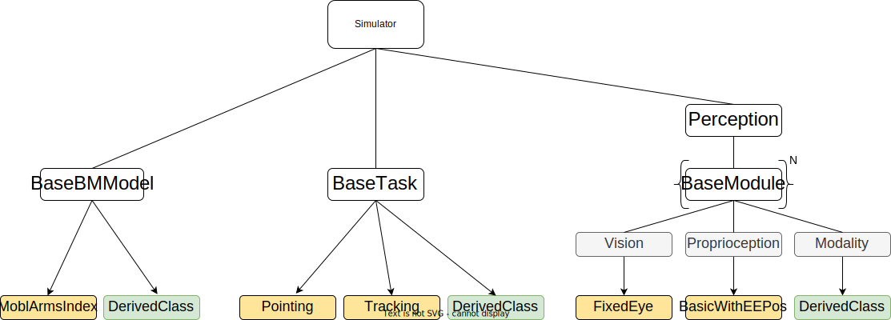
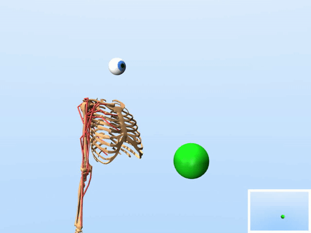
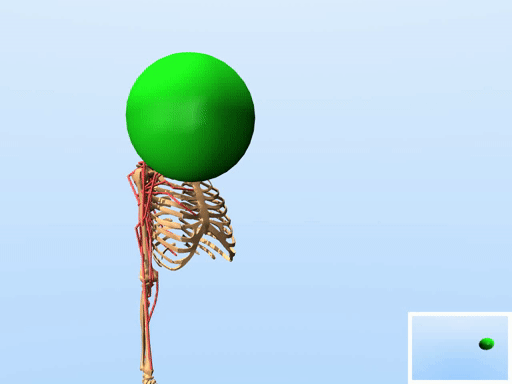
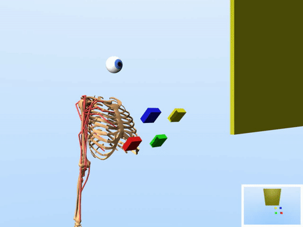
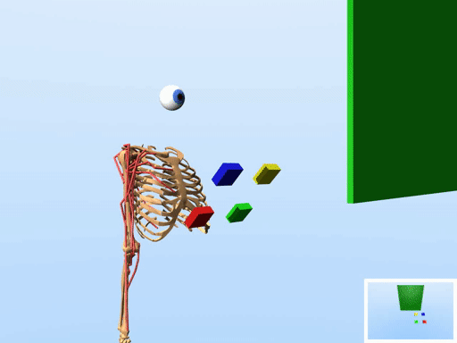
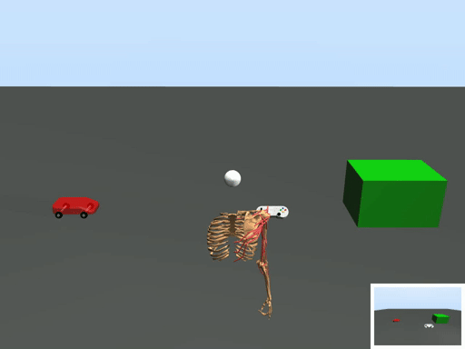
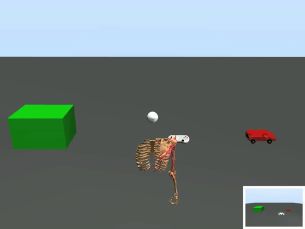
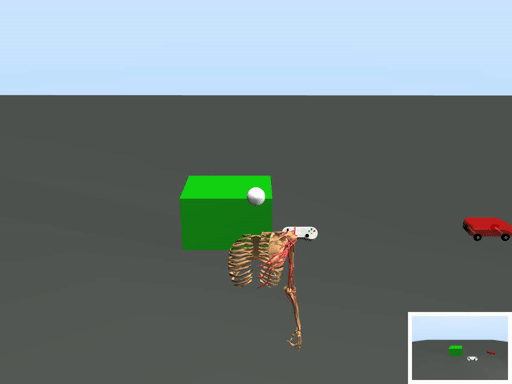

# User-in-the-Box

- This repository contains source code for modeling and simulating HCI interaction tasks in [MuJoCo](https://mujoco.org/). The user is modeled with a muscle-actuated biomechanical model with perception capabilities (e.g. egocentric vision), and is trained with reinforcement learning to solve the interaction task.
- The source code provides a flexible (modular) approach to implementing new biomechanical models, perception models, and interaction tasks.
- The produced models/simulations (which will be henceforth referred to as *simulators*) are designed to run as standalone packages that can be easily shared with others. These simulators inherit and implement the OpenAI Gym interface, and hence they are easy to use and e.g. can be easily plugged into existing RL training libraries.


## Papers

### [Breathing Life into Biomechanical User Models (UIST2022)](https://dl.acm.org/doi/abs/10.1145/3526113.3545689)

https://user-images.githubusercontent.com/7627254/184347198-2d7f8852-d50b-457f-8eaa-07720b9522eb.mp4

[Click here for a Youtube version (with subtitles)](https://youtu.be/-L2hls8Blyc)

Please cite this paper if you use this *User-in-the-Box* repository in your research.

```
@inproceedings{ikkala2022,

author = {Ikkala, Aleksi and Fischer, Florian and Klar, Markus and Bachinski, Miroslav and Fleig, Arthur and Howes, Andrew and H\"{a}m\"{a}l\"{a}inen, Perttu and M\"{u}ller, J\"{o}rg and Murray-Smith, Roderick and Oulasvirta, Antti},
title = {Breathing Life Into Biomechanical User Models},
year = {2022},
isbn = {9781450393201},
publisher = {Association for Computing Machinery},
address = {New York, NY, USA},
url = {https://doi.org/10.1145/3526113.3545689},
doi = {10.1145/3526113.3545689},
booktitle = {Proceedings of the 35th Annual ACM Symposium on User Interface Software and Technology},
articleno = {90},
numpages = {14},
location = {Bend, OR, USA},
series = {UIST '22}}
```

### [Converting Biomechanical Models from OpenSim to MuJoCo (ICNR2020)](https://arxiv.org/abs/2006.10618)

The [`mobl_arms`](https://github.com/aikkala/user-in-the-box/tree/main/uitb/bm_models/mobl_arms) biomechanical model and its variant [`mobl_arms_index`](https://github.com/aikkala/user-in-the-box/tree/main/uitb/bm_models/mobl_arms_index) have been converted from OpenSim to MuJoCo using the [O2MConverter](https://github.com/aikkala/O2MConverter) (with some of the parameters further optimized).


## Implementation

The main entry point is **[uitb.simulator.Simulator](https://github.com/aikkala/user-in-the-box/blob/main/uitb/simulator.py)** class, which implements an OpenAI Gym interface. A *simulator* (instance of the Simulator class) consists of three main components: 1) an interaction task (defined as a MuJoCo xml file wrapped in a Python class), 2) a biomechanical model (defined as a MuJoCo xml file wrapped in a Python class), and 3) a perception model (defined as a set of *perception modules*, which are Python classes). In order to add new tasks, biomechanical models, or perception modules, one needs to create new Python modules/classes that inherit from their respective base classes (see below for further instructions).

<br/>

|  |
|:--:|
| **Figure 1.** This figure shows the three main components and their relations. The white boxes are classes that a user should not need to edit. The yellow boxes are examples of classes that have already been implemented, and the green boxes indicate classes that need to be implemented when adding new models or tasks. The arrows indicate inheritance. The _Perception_ class contains a set of perception modules (e.g. vision, proprioception). Also, the grey boxes under *Perception* indicate a hierarchical folder structure, which are not actual classes themselves. |

<br/>

### Biomechanical models

The biomechanical models are defined in [uitb/bm_models](https://github.com/aikkala/user-in-the-box/tree/main/uitb/bm_models). When creating new biomechanical models, one must inherit from the base class **[uitb.bm_models.base.BaseBMModel](https://github.com/aikkala/user-in-the-box/tree/main/uitb/bm_models/base.py)**. In addition to implementing a Python class, the biomechanical model must be defined as a (standalone) MuJoCo xml file. One option to creating new biomechanical models is to import them from [OpenSim](https://simtk.org/projects/opensim) models with an [OpenSim-to-MuJoCo converter](https://github.com/aikkala/O2MConverter).

Related to the biomechanical models, in file [uitb/bm_models/effort_models.py](https://github.com/aikkala/user-in-the-box/blob/main/uitb/bm_models/effort_models.py) we have pre-defined a few effort models (WIP). These can be extended as well.


### Interaction tasks

Interaction tasks are defined in [uitb/tasks](https://github.com/aikkala/user-in-the-box/tree/main/uitb/tasks). When creating new tasks, one must inherit from the base class **[uitb.tasks.base.BaseTask](https://github.com/aikkala/user-in-the-box/blob/main/uitb/tasks/base.py)**. In addition to implementing a Python class, the interaction task must be defined as a (standalone) MuJoCo xml file.

_[v2.0 and later only:]_ To interact with a Unity VR Environment using the [SIM2VR System](https://github.com/fl0fischer/sim2vr), use the [UnityTask](https://github.com/aikkala/user-in-the-box/tree/main/uitb/tasks/unity/Unity.py) task class. For further details, see the [SIM2VR README](https://github.com/fl0fischer/sim2vr).

### Perception models

A perception model is composed of a set of perception modules, where each module is a specific perception capability, such as vision (egocentric camera) or proprioception (positions, speeds, accelerations of the biomechanical model's joints etc.). The perception modules are defined in [uitb/perception](https://github.com/aikkala/user-in-the-box/blob/main/uitb/perception)/[modality], where [modality] refers to a specific modality like "vision" or "proprioception". Note that this extra [modality] layer might be removed in the future. The base class that must be inherited when creating new perception modules is **[uitb.perception.base.BaseModule](https://github.com/aikkala/user-in-the-box/blob/main/uitb/perception/base.py)**.

_[v2.0 and later only:]_ To interact with a Unity VR Environment using the [SIM2VR System](https://github.com/fl0fischer/sim2vr), use the [UnityHeadset](https://github.com/aikkala/user-in-the-box/tree/main/uitb/perception/vision/unity_headset/UnityHeadset.py)) vision module. For further details, see the [SIM2VR README](https://github.com/fl0fischer/sim2vr).

### Building a simulator

A simulator is built according to a _config file_ (in yaml format), which defines which models are selected and integrated together to create the simulator. For examples of such config files see [uitb/configs](https://github.com/aikkala/user-in-the-box/blob/main/uitb/configs). In a nutshell, the build process contains two phases. Firstly, the MuJoCo xml file that defines the biomechanical model is integrated into the MuJoCo xml file that defines the interaction task environment, and hence a new standalone MuJoCo xml file is created. Secondly, wrapper classes are called to make sure everything are initialised correctly (e.g. a class inheriting from `BaseTask` might need to move an interaction device to a proper position with respect to a biomechanical model). These initialisations must be defined in the constructors of wrapper classes.

The simulator is built into folder *[project_path/]simulators/config["simulator_name"]*, which is a standalone package that contains all the necessary codes to run the simulator (given that required Python packages are installed), and hence can be easily shared with others. 

**Note that the simulator name (defined in the config file) should be a valid Python package name (e.g. use underscores instead of dashes).**

```python
from uitb import Simulator

# Define the path to a config file
config_file = "/path/to/config_file.yaml"

# Build the simulator
simulator_folder = Simulator.build(config_file)

```

### Running a simulator

Once a simulator has been built as shown above, you can initialise the simulator with 

```python
simulator = Simulator.get(simulator_folder)
```

and `simulator` can be run in the same way as any OpenAI Gym environment (i.e. by calling methods `simulator.step(action)`, `simulator.reset()`). **IF** the simulator folder is in Python path, one can also import a simulator with its name, and initialise it with `gymnasium`. E.g. if config["simulator_name"] = "mobl_arms_index_pointing"

```python
# Import the simulator
import mobl_arms_index_pointing

# Initialise a simulator with gym(nasium)
import gymnasium as gym
simulator = gym.make("uitb:mobl_arms_index_pointing-v0")
```

Note the prefix `uitb:` and suffix `-v0` that must be used to satisfy OpenAI Gym's naming conventions. Alternatively, you can programmatically import a simulator and then initialise with gymnasium

```python
# Add simulator_folder to Python path
import sys
sys.path.insert(0, simulator_folder)

# Import the module so that the gym env is registered
import importlib
importlib.import_module("mobl_arms_index_pointing")

# Initialise a simulator with gym(nasium)
import gymnasium as gym
simulator = gym.make("uitb:mobl_arms_index_pointing-v0")
```


## Installation / Setup

- The conda environment defined in `conda_env.yml` should contain all required packages. Create a new conda env with `conda env create -f conda_env.yml` and activate it with `conda activate uitb`.

- Alternatively, you can install the `uitb` python package from the main directory via
  ```bash
  pip install .
  ```
  or (editable)
  
  ```bash
  pip install -e .
  ```

- **IMPORTANT:** In case of headless rendering (e.g., in Jupyter Notebook/Google Colab files), EGL needs to be set as rendering backend (requires a GPU), either from commmand line: 
  ```bash
  export MUJOCO_GL=egl
  ```
  or, using ipython line magic in .ipynb files:
  ```python
  %env MUJOCO_GL=egl
  ```


## Training

The script [uitb/train/trainer.py](https://github.com/aikkala/user-in-the-box/blob/main/uitb/train/trainer.py) takes as a input a config file, then calls `Simulation.build(config)` to build the simulator, and then starts running the RL training using stable-baselines3. Other RL libraries can be defined in [uitb/rl](https://github.com/aikkala/user-in-the-box/blob/main/uitb/rl), and they must inherit from the base class **[uitb.rl.base.BaseRLModel](https://github.com/aikkala/user-in-the-box/blob/main/uitb/rl/base.py)**. Weights & Biases is used for logging. 

Note that you need to define a reward function when creating new interaction tasks. The implementation details of the reward function are (at least for now) left for users to decide. 

The simulation data directory can be set from the config file using the `simulator_folder` tag. By default, simulation data is stored at `SIMULATORS_DIR` as defined in uitb/utils/\_\_simulatorsdir__.py, if this file exists (which is usually created during installation), or at [simulators](https://github.com/aikkala/user-in-the-box/blob/main/simulators).

To resume training at a stored checkpoint, either pass `--resume` to [uitb/train/trainer.py](https://github.com/aikkala/user-in-the-box/blob/main/uitb/train/trainer.py) to use the latest checkpoint stored, or `--checkpoint <checkpoint_filename>` to use a specific checkpoint. If training is started from the scratch, the checkpoint directory (if existing) is backed up and cleared for the sake of clarity. 

Regular evaluations can be added to the training loop by passing the `--eval` flag. This flag takes the number of steps after which an evaluation is performed as optional argument. In addition, the `--eval_info_keywords` flag allows to log custom environment variables during evaluation, as long as these are included in the "info" dict returned by the step function. At the moment, the logs only include (mean) values at the end of an episode, i.e., when `terminated` or `truncated` is True. For example, to log the percentage of evaluation episodes at which the end-effector is inside the target and/or has succesfully "hit" the target at the end of the episode, `--eval_info_keywords inside_target target_hit` can be used.

**Important**: To create a modified simulation task and/or environment to run training with, do **NOT** change the Python code inside the [simulators](https://github.com/aikkala/user-in-the-box/blob/main/simulators) directory, but always modify the original source code inside the [uitb](https://github.com/aikkala/user-in-the-box/blob/main/uitb) directory (e.g., by copying a task directory, modifying the code accordingly, and registering the new task in [uitb/tasks/\_\_init__.py](https://github.com/aikkala/user-in-the-box/blob/main/uitb/tasks/__init__.py).


## Pre-trained simulators

| **Task**                           | **Simulator**                                           | **Config file**                  |
|------------------------------------|----------------------------------------------------------|-----------------------------|
| Pointing                           | [simulators/mobl_arms_index_pointing](https://github.com/aikkala/user-in-the-box/tree/main/simulators/mobl_arms_index_pointing)                    | [uitb/configs/mobl_arms_index_pointing.yaml](https://github.com/aikkala/user-in-the-box/blob/main/uitb/configs/mobl_arms_index_pointing.yaml) |
| Tracking                           | [simulators/mobl_arms_index_tracking](https://github.com/aikkala/user-in-the-box/tree/main/simulators/mobl_arms_index_tracking)                                     | [uitb/configs/mobl_arms_index_tracking.yaml](https://github.com/aikkala/user-in-the-box/blob/main/uitb/configs/mobl_arms_index_tracking.yaml)  |
| Choice Reaction                       | [simulators/mobl_arms_index_choice_reaction](https://github.com/aikkala/user-in-the-box/tree/main/simulators/mobl_arms_index_choice_reaction)                  | [uitb/configs/mobl_arms_index_choice_reaction.yaml](https://github.com/aikkala/user-in-the-box/blob/main/uitb/configs/mobl_arms_index_choice_reaction.yaml) |
| Controlling an RC Car Via Joystick | [simulators/mobl_arms_index_remote_driving](https://github.com/aikkala/user-in-the-box/tree/main/simulators/mobl_arms_index_remote_driving) | [uitb/configs/mobl_arms_index_remote_driving.yaml](https://github.com/aikkala/user-in-the-box/blob/main/uitb/configs/mobl_arms_index_remote_driving.yaml) |


- The simulators that were trained, evaluated, and analysed in our [UIST paper](TODO-add-a-working-link) as well as a script to re-create all plots from this paper can be found in a [separate branch](https://github.com/aikkala/user-in-the-box/tree/uist-submission-aleksi).

### Pointing examples

  

### Tracking examples

  

### Choice reaction examples

  

### Controlling an RC Car examples

  


## Testing

One can use the script [uitb/test/evaluator.py](https://github.com/aikkala/user-in-the-box/blob/main/uitb/test/evaluator.py) to evaluate the performance of a trained simulator. The script runs the simulator/policy and optionally saves log files and videos of the evaluated episodes. Example usage:

```
python uitb/test/evaluator.py simulators/mobl_arms_index_pointing --num_episodes 10 --record --logging --action_sample_freq 100
```

The above runs the pre-trained simulator `mobl_arms_index_pointing` for 10 episodes, records videos and saves log files of the evaluted episodes, and samples actions with a frequency of 100 Hz from the policy. The videos and log files will  be saved inside `simulators/mobl_arms_index_pointing/evaluate` folder. Run `python uitb/test/evaluator.py --help` for more information.


## TODO list
- cameras, lighting
- separate Task class into World and Task classes, where the former defines the world and the latter defines only the interactive task?

## Troubleshooting
No currently known issues.


## Acknowledgments
We would like to thank our students Dominik Ermer, Jannic Herrmann, Lisa Müller and Ferdinand Schäffler for providing the initial model of the gamepad and the car used in the remote driving environment.


## Contributors
Aleksi Ikkala  
Florian Fischer  
Markus Klar  
Arthur Fleig  
Miroslav Bachinski  
Andrew Howes  
Perttu Hämäläinen  
Jörg Müller  
Roderick Murray-Smith  
Antti Oulasvirta  
